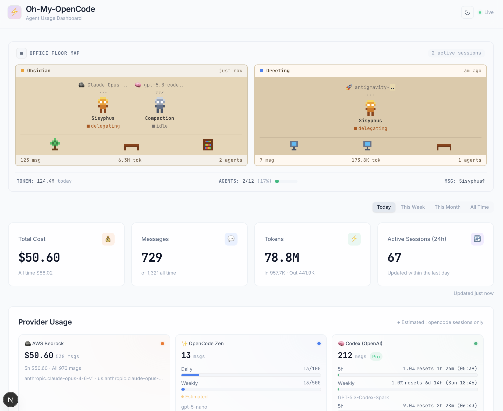
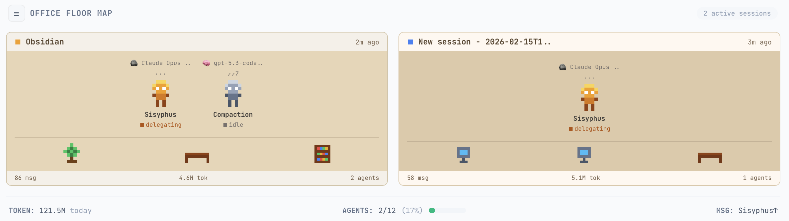
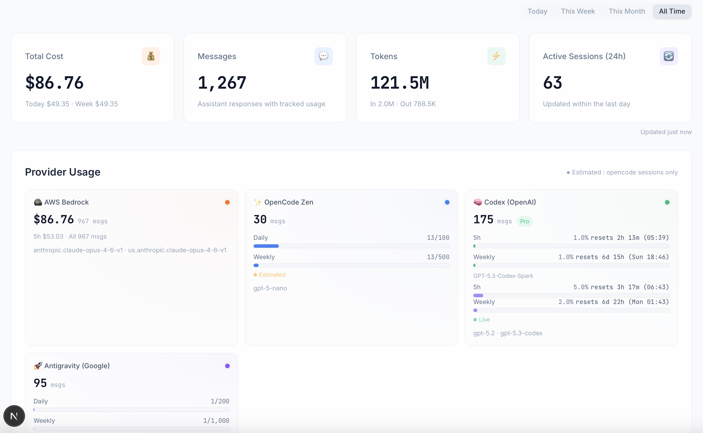
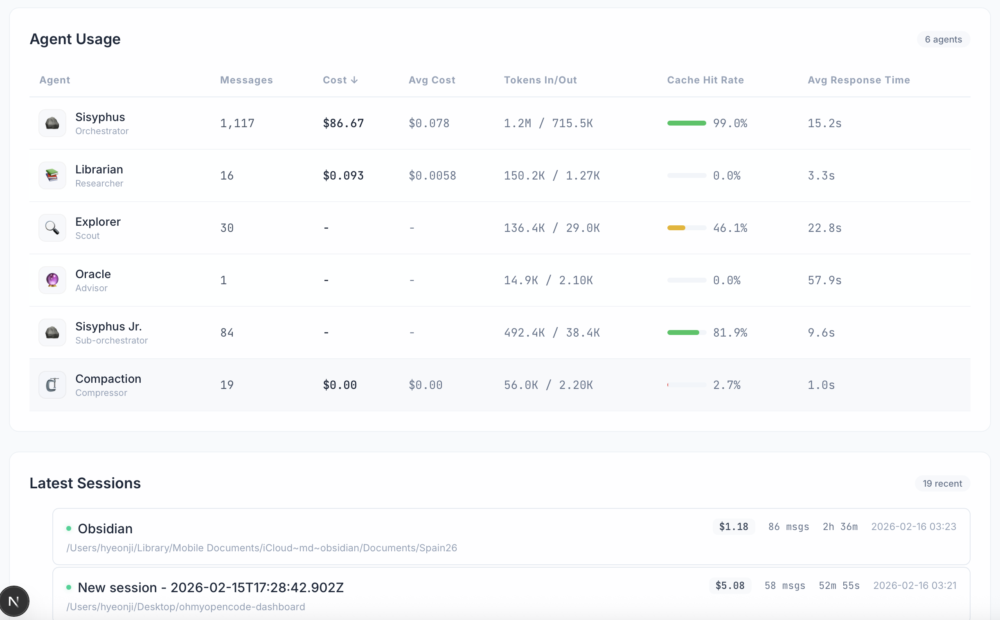

<div align="center">


  <br />
  <br />

  <pre align="center">
┌──────────────────────────────────────────────────────────────────────┐
│                                                                      │
│                                                                      │
│   █▀▀█ █░░█ ░░ █▀▄▀█ █░░█ ░░ █▀▀█ █▀▀█ █▀▀ █▀▀▄ █▀▀ █▀▀█ █▀▀▄ █▀▀    │
│   █░░█ █▀▀█ ▀▀ █░▀░█ █▄▄█ ▀▀ █░░█ █░░█ █▀▀ █░░█ █░░ █░░█ █░░█ █▀▀    │
│   ▀▀▀▀ ▀░░▀ ░░ ▀░░░▀ ▄▄▄█ ░░ ▀▀▀▀ █▀▀▀ ▀▀▀ ▀░░▀ ▀▀▀ ▀▀▀▀ ▀▀▀░ ▀▀▀    │
│                                                                      │
│   █▀▀▄ █▀▀█ █▀▀ █░░█ █▀▀▄ █▀▀█ █▀▀█ █▀▀▄                             │
│   █░░█ █▄▄█ ▀▀█ █▀▀█ █▀▀▄ █░░█ █▄▄█ █░░█                             │
│   ▀▀▀░ ▀░░▀ ▀▀▀ ▀░░▀ ▀▀▀░ ▀▀▀▀ ▀░░▀ ▀▀▀░                             │
│                                                                      │
│                                                                      │
├──────────────────────────────────────────────────────────────────────┤
│     ●  OPENCODE MONITOR                                  v1.0.0      │
├──────────────────────────────────────────────────────────────────────┤
│                                                                      │
│     > CONNECTING TO DATABASE...                          [ OK ]      │
│     > LOADING AGENT SPRITES...                           [ OK ]      │
│     > CALCULATING TOKEN COSTS...                         [ OK ]      │
│                                                                      │
│     [ ■■■■■■■■■■■■■■■■■■■■■■■■■■■■■■■■■■■■■■■■■■■■■■■■■■ ] 100%      │
│                                                                      │
│     > SYSTEM STATUS: READY TO MONITOR                                │
│                                                                      │
└──────────────────────────────────────────────────────────────────────┘
  </pre>

  <p>
    <I>Wait, is that my agent working over there?</I> 🕵️‍♂️
    <br/>
    <strong>Local-only analytics & visualization for OpenCode</strong>
  </p>
  
  <p>
    <a href="https://nextjs.org">
      
    </a>
    <a href="https://react.dev">
      
    </a>
    <a href="https://www.typescriptlang.org/">
      
    </a>
    <a href="https://tailwindcss.com">
      
    </a>
  </p>


</div>

## Features


Explore your agent's world through a retro-futuristic lens. The dashboard combines high-fidelity analytics with a playful pixel-art interface to make monitoring costs and performance actually fun.

### 🏢 Office Floor Map


**Pixel-art visualization** of active sessions. Watch your agents work in real-time as characters on a virtual office floor.

### 📊 Summary & Provider Usage


- **Summary Cards** — Track total cost, messages, tokens, and active sessions with period filtering (Today / Week / Month / All Time).
- **Provider Usage** — Monitor per-provider limits (e.g., OpenAI, Anthropic) with visual progress bars for daily/weekly caps.
- **Codex Live Usage** — (Optional) Real-time OpenAI rate limit monitoring via Codex CLI integration.

### 🤖 Agent Details & Sessions


- **Agent Table** — Sortable agent-level stats: messages, cost, tokens in/out, cache hit rate, and average response time.
- **Session List** — Hierarchical view of session trees. Expand/collapse to trace sub-agent execution and drill down into details.
- **System Theme** — Dark/Light mode support with smooth transitions.


## Prerequisites

- **Node.js** >= 18 (or [Bun](https://bun.sh))
- **OpenCode** installed and used at least once (so the SQLite DB exists)

## Quick Start

```bash
# Clone
git clone https://github.com/your-org/oh-my-opencode-dashboard.git
cd oh-my-opencode-dashboard

# Install dependencies
bun install    # or: npm install

# Start dev server
bun dev        # or: npm run dev
```

Open [http://localhost:3000](http://localhost:3000).

The dashboard reads from `~/.local/share/opencode/opencode.db` by default. If your DB is elsewhere, set the env var:

```bash
OPENCODE_DB_PATH=/path/to/opencode.db bun dev
```

## Codex Live Usage (Optional)

The Provider Usage section can show **real-time rate limit data** from OpenAI (used %, reset countdown, plan type) instead of estimated message counts.

This requires the [Codex CLI](https://github.com/openai/codex) to be installed and authenticated:

```bash
# 1. Install Codex CLI
npm install -g @openai/codex

# 2. Authenticate (creates ~/.codex/auth.json)
codex --login
```

Once `~/.codex/auth.json` exists with a valid access token, the dashboard automatically fetches live usage from the OpenAI API. The OpenAI provider card will show a green **Live** badge instead of the amber **Estimated** badge.

If Codex is not installed or the token is missing/expired, the dashboard falls back to estimated usage based on local message counts — no errors, no setup required.

|                 | Without Codex              | With Codex             |
| --------------- | -------------------------- | ---------------------- |
| OpenAI usage    | Estimated from local DB    | Live from OpenAI API   |
| Rate limit bars | Daily/Weekly message count | 5h/1w rolling window % |
| Plan info       | Not shown                  | Pro/Plus/Free badge    |
| Reset timer     | Not shown                  | Countdown + timestamp  |

### Codex Environment Variables

| Variable                 | Default                           | Description                    |
| ------------------------ | --------------------------------- | ------------------------------ |
| `CODEX_HOME`             | `~/.codex`                        | Path to Codex config directory |
| `CODEX_CHATGPT_BASE_URL` | `https://chatgpt.com/backend-api` | ChatGPT API base URL           |

## Environment Variables

| Variable                | Default                               | Description                                  |
| ----------------------- | ------------------------------------- | -------------------------------------------- |
| `OPENCODE_DB_PATH`      | `~/.local/share/opencode/opencode.db` | Path to OpenCode SQLite database             |
| `OPENCODE_STORAGE_PATH` | `~/.local/share/opencode/storage`     | Legacy storage path                          |
| `CLAUDE_5H_LIMIT`       | `5`                                   | Anthropic subscription 5-hour cost limit ($) |

## Tech Stack

| Layer     | Technology                                 |
| --------- | ------------------------------------------ |
| Framework | Next.js 15 (App Router, Server Components) |
| UI        | React 19, Tailwind CSS 4                   |
| Charts    | Recharts 2, Framer Motion 12               |
| Data      | better-sqlite3 (readonly)                  |
| Language  | TypeScript 5                               |

## Project Structure

```
app/
  page.tsx                    # Main dashboard (Server Component)
  sessions/[sessionId]/       # Session detail drill-down
  api/dashboard/              # Client-side refresh endpoint
components/
  dashboard/                  # SummaryCards, AgentTable, ProviderBreakdown, SessionList
  visualizations/             # OfficeFloorMap, AgentBubbles, CostTreemap, etc.
  ui/                         # EmptyState, ErrorBanner
lib/
  data/reader.ts              # SQLite read layer
  data/parser.ts              # Message field extraction
  data/aggregator.ts          # Aggregation logic
  data/codex-usage.ts         # Codex live API client
  types.ts                    # TypeScript interfaces
  constants.ts                # Provider/Agent metadata
  utils.ts                    # Formatting utilities
```

## Supported Providers

| Provider         | Billing Type            | Display Name         |
| ---------------- | ----------------------- | -------------------- |
| `amazon-bedrock` | API (per-token)         | AWS Bedrock          |
| `anthropic`      | Subscription            | Anthropic (Direct)   |
| `openai`         | Account (message limit) | Codex (OpenAI)       |
| `google`         | Account (message limit) | Antigravity (Google) |
| `opencode`       | Account (message limit) | OpenCode Zen         |
| `copilot`        | Account (message limit) | GitHub Copilot       |

### Message Limits

Account-type providers show daily/weekly usage bars based on the limits below. **These are rough estimates from community reports and may not match your actual plan.** If the numbers are wrong for your setup, edit `lib/constants.ts` (`PROVIDER_MAP` > `weeklyMessageLimit` / `dailyMessageLimit`).

| Provider             | Daily Limit | Weekly Limit |
| -------------------- | ----------- | ------------ |
| OpenAI (Codex)       | 200         | 1,000        |
| Google (Antigravity) | 200         | 1,000        |
| OpenCode Zen         | 100         | 500          |
| GitHub Copilot       | 300         | 2,100        |

## Local Only

This dashboard reads a local SQLite file directly via `better-sqlite3`. It is designed for `next dev` or local builds only. Remote deployment (Vercel, etc.) is not supported without an additional API layer.

## License

MIT
